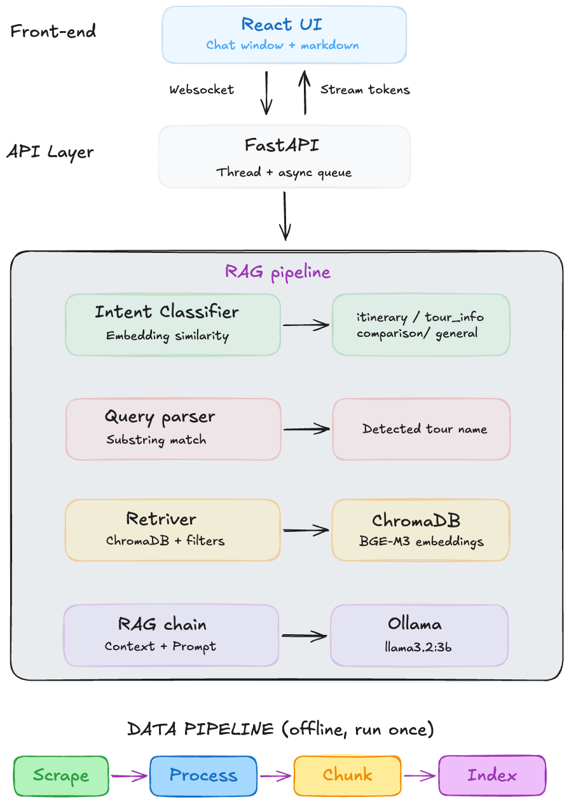
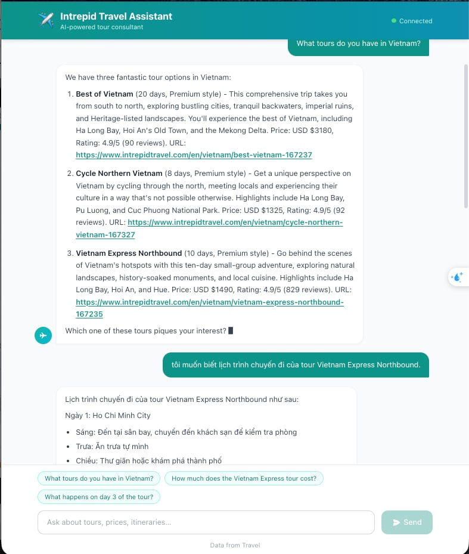
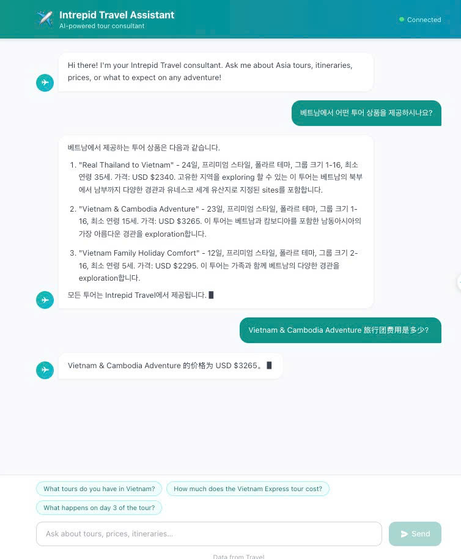

# RAG Tourism Chatbot

An AI-powered travel consultant chatbot for **Intrepid Travel** Asia tours. Customers ask questions in any language and receive grounded answers based on real tour data — prices, itineraries, highlights, and booking links — powered by a local LLM with no cloud dependency.

---

## Architecture



## Demo


***Demo 1: chatbot supports multiple language***


***Demo 2: chatbot supports multiple language***

## How It Works

```
User question
     │
     ▼
IntentClassifier ──── embedding similarity (no LLM) ────► intent
     │                                                    (itinerary / tour_info / comparison / general)
     ▼
QueryParser ──────── substring match ───────────────────► detected tour name (if any)
     │
     ▼
Retriever ────────── ChromaDB semantic search + filters ► top-k chunks
     │                  (type, tour name, price, style)
     ▼
RAGChain ─────────── format context + build prompt ─────► Ollama (llama3.2:3b)
     │
     ▼
FastAPI ──────────── WebSocket stream / HTTP POST ──────► React UI
```

---

## Features

- Semantic retrieval using BGE-M3 embeddings

- Metadata-aware chunk filtering

- Streaming chat responses via WebSocket

- Embedding-based intent classification

- Local LLM inference with Ollama

- Modular ETL pipeline for indexing tourism data

- React frontend with real-time chat UI

## Tech Stack

| Layer | Technology |
|---|---|
| LLM | [llama3.2:3b](https://ollama.com/library/llama3.2) via Ollama (https://ollama.com) (local, no cloud) |
| Embeddings | `BAAI/bge-m3` via `sentence-transformers` |
| Vector store | ChromaDB (persistent, cosine similarity) |
| API | FastAPI + Uvicorn |
| Frontend | React 18 + Vite + Tailwind CSS |
| Scraping | requests + BeautifulSoup4 |

---

## Project Structure

```
rag-tourism-chatbot/
├── main.py                     # FastAPI app entry point
├── requirements.txt
├── pyproject.toml
│
├── app/
│   ├── api/
│   │   └── routes.py           # POST /api/chat, WS /api/ws/chat, GET /api/health
│   ├── config/
│   │   ├── settings.py         # Pydantic settings (reads .env)
│   │   └── constants.py        # ChunkType, TourStyle enums, ASIA_DESTINATIONS
│   ├── models/
│   │   └── schemas.py          # ChatRequest / ChatResponse Pydantic models
│   ├── rag/
│   │   ├── chain.py            # RAGChain: full pipeline (intent → retrieve → LLM)
│   │   ├── retriever.py        # ChromaDB search with metadata filters
│   │   ├── intent_classifier.py# Embedding-based intent classifier (no LLM needed)
│   │   ├── query_parser.py     # Extracts tour name from user query
│   │   └── prompt_templates.py # System prompt + RAG prompt template
│   └── utils/
│       └── logger.py           # Logging setup (stdout + file)
│
├── scripts/                    # One-time data pipeline — run in order
│   ├── scrape_listings.py      # Phase 1: collect tour URLs from intrepidtravel.com
│   ├── scrape_details.py       # Phase 2: scrape full detail page per tour
│   ├── process_data.py         # Phase 3: convert raw JSON → RAG chunks
│   └── index_data.py           # Phase 4: embed chunks → ChromaDB
│
├── data/
│   ├── raw/                    # Scraped JSON (gitignored)
│   └── processed/              # chunks.json (gitignored)
│
├── vector_store/               # ChromaDB persistent storage
├── logs/                       # app.log
│
└── ui/                         # React frontend
    ├── src/
    │   ├── App.jsx             # WebSocket logic + state
    │   └── components/
    │       ├── ChatWindow.jsx
    │       ├── Message.jsx     # Markdown rendering, tour link embedding
    │       ├── InputBar.jsx    # Textarea, suggestions
    │       └── ConnectionStatus.jsx
    └── package.json
```

---

## Prerequisites

- **Python 3.10+**
- **Node.js 18+**
- **[Ollama](https://ollama.com)** installed and running

Pull the LLM model once:
```bash
ollama pull llama3.2:3b
```

---

## Setup

### 1. Create and activate a virtual environment

```bash
cd rag-tourism-chatbot
python -m venv .venv
source .venv/bin/activate        # macOS / Linux
# .venv\Scripts\activate         # Windows
```

### 2. Install Python dependencies

```bash
pip install -r requirements.txt
```

> **Note on PyTorch:** `sentence-transformers` installs PyTorch automatically. If you want GPU/MPS acceleration, install the appropriate torch variant first — see [pytorch.org/get-started](https://pytorch.org/get-started/locally/).

### 3. Configure environment (optional)

Copy and edit `.env` to override defaults:

```bash
cp .env.example .env
```

| Variable | Default | Description |
|---|---|---|
| `OLLAMA_BASE_URL` | `http://localhost:11434` | Ollama server URL |
| `LLM_MODEL` | `llama3.2:3b` | Ollama model name |
| `EMBEDDING_MODEL` | `BAAI/bge-m3` | HuggingFace embedding model |
| `CHROMA_COLLECTION` | `tourism_data` | ChromaDB collection name |
| `API_HOST` | `0.0.0.0` | API bind address |
| `API_PORT` | `8000` | API port |

---

## Data Pipeline

Run these scripts once to build the vector store. Skip if you already have `vector_store/` populated.

```bash
# Phase 1 — scrape tour listing pages (collects URLs + basic info)
python -m scripts.scrape_listings

# Phase 2 — scrape full detail page for each tour (itinerary, price, description)
python -m scripts.scrape_details

# Phase 3 — convert raw JSON into RAG-ready chunks
python -m scripts.process_data

# Phase 4 — embed chunks and store in ChromaDB
python -m scripts.index_data
```

Each phase reads from and writes to `data/raw/` and `data/processed/`. The final output is written to `vector_store/`.

---

## Running the Application

### Start the API server

```bash
# Make sure Ollama is running
ollama serve

# Start FastAPI
python main.py
# or
uvicorn main:app --reload --host 0.0.0.0 --port 8000
```

API is available at `http://localhost:8000`.

### Start the React frontend

```bash
cd ui
npm install
npm run dev
```

UI is available at `http://localhost:3000`.

---

## API Endpoints

### `POST /api/chat`
HTTP endpoint — returns the complete answer in one response.

**Request:**
```json
{ "message": "What tours do you have in Vietnam?" }
```

**Response:**
```json
{ "answer": "We have three fantastic tour options in Vietnam: ..." }
```

### `WS /api/ws/chat`
WebSocket endpoint — streams the answer token by token.

**Send:**
```json
{ "message": "What tours do you have in Vietnam?" }
```

**Receive (stream):**
```json
{ "type": "token", "content": "We " }
{ "type": "token", "content": "have " }
...
{ "type": "done", "sources": [{ "name": "Best of Vietnam", "url": "https://..." }] }
```

### `GET /api/health`
```json
{ "status": "ok" }
```

---

## Chunk Types

Each tour is stored as three chunk types in ChromaDB:

| Type | Content |
|---|---|
| `tour_overview` | Name, description, price, duration, style, highlights, URL |
| `itinerary_day` | One chunk per day — location, activities, meals, accommodation |
| `practical_info` | All transport, accommodation types, and activities summarised |

The retriever filters by chunk type based on detected intent (e.g., itinerary questions pull only `itinerary_day` chunks).

---

## Intent Classification

The chatbot classifies questions without an LLM using embedding cosine similarity against example phrases:

| Intent | Triggers |
|---|---|
| `itinerary` | "What happens on day 3?", "Show me the daily schedule" |
| `tour_info` | "How much does this cost?", "How long is the tour?" |
| `comparison` | "Compare these tours", "Which is cheaper?" |
| `general` | "Do I need a visa?", "What's the weather like?" |
